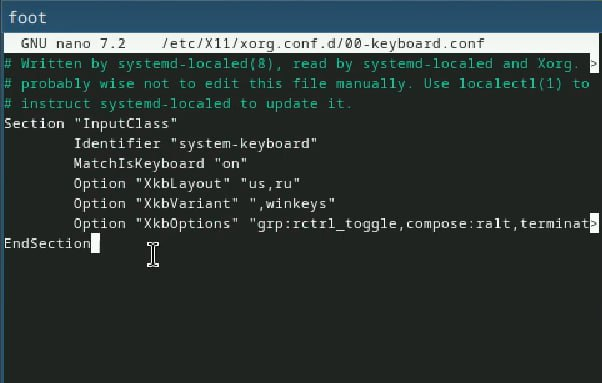

---
## Front matter
lang: ru-RU
title: Лабораторная работа №1
subtitle: Установка и конфигурация операционной системы на виртуальную машину
author:
  - Газизянов Владислав Альбертович
institute:
  - Российский университет дружбы народов, Москва, Россия
## i18n babel
babel-lang: russian
babel-otherlangs: english

## Formatting pdf
toc: false
toc-title: Содержание
slide_level: 2
aspectratio: 169
section-titles: true
theme: metropolis
header-includes:
 - \metroset{progressbar=frametitle,sectionpage=progressbar,numbering=fraction}
 - '\makeatletter'
 - '\beamer@ignorenonframefalse'
 - '\makeatother'
 
## Fonts
mainfont: PT Serif
romanfont: PT Serif
sansfont: PT Sans
monofont: PT Mono
mainfontoptions: Ligatures=TeX
romanfontoptions: Ligatures=TeX
sansfontoptions: Ligatures=TeX,Scale=MatchLowercase
monofontoptions: Scale=MatchLowercase,Scale=0.9
---

# Цель

## Цель

Приобритение навыков по установке операционной системы и сервисов, необходимвх для работы с ней.

# Выполнение лабораторной работы

## установка Fedora Sway и базовые настройки
:::::::::::::: {.columns align=center}
::: {.column width="50%"}

.jpeg)
:::
::::::::::::::
## устанавливка OC
:::::::::::::: {.columns align=center}
::: {.column width="50%"}

.jpeg)
:::
::::::::::::::

## Включаем автообновления и загружаем tmux
:::::::::::::: {.columns align=center}
::: {.column width="50%"}

.jpeg)
:::
::::::::::::::

## Отключаем SELinux

:::::::::::::: {.columns align=center}
::: {.column width="70%"}

.jpeg)
:::
::::::::::::::

## обновляем драйвера

:::::::::::::: {.columns align=center}
::: {.column width="50%"}

.jpeg)
:::
::::::::::::::

## меняем настройки клавиатуры
:::::::::::::: {.columns align=center}
::: {.column width="50%"}

:::
::::::::::::::

## Установка имени хоста

:::::::::::::: {.columns align=center}
::: {.column width="50%"}

.jpeg)
:::
::::::::::::::

## Подключаем общую папку

:::::::::::::: {.columns align=center}
::: {.column width="50%"}

.jpeg)
:::
::::::::::::::

## СУстанавливаем Markdown and texlive
:::::::::::::: {.columns align=center}
::: {.column width="50%"}
.jpeg)
:::
::::::::::::::

# Домашняя задание

## Домашняя задание

Следует получить следующую информацию:

Версия ядра Linux (Linux version).
Частота процессора (Detected Mhz processor).
Модель процессора (CPU0).
Объём доступной оперативной памяти (Memory available).
Тип обнаруженного гипервизора (Hypervisor detected).
Тип файловой системы корневого раздела.
Последовательность монтирования файловых систем.

## Домашнее задание

:::::::::::::: {.columns align=center}
::: {.column width="50%"}
.jpeg)
:::
::::::::::::::

# Контрольные вопросы

## Ответы на контрольные вопросы 

1. Какую информацию содержит учётная запись пользователя?
-Первые буквы имени и отчества, а также фамилию

2. Укажите команды терминала и приведите примеры:

    для получения справки по команде;
    -man
    для перемещения по файловой системе;
    -cd
    для просмотра содержимого каталога;
    -ls
    для определения объёма каталога;
    -du
    для создания / удаления каталогов / файлов;
    -touch, mkdir, rm
    для задания определённых прав на файл / каталог;
    -chmod
    для просмотра истории команд.
	history	
	
## Ответы на контрольные вопросы

3. Что такое файловая система? Приведите примеры с краткой характеристикой.
-Это способо организации файлов и каталогов на диске.
EXT2-4 - наиболее стабильная в связи с редкими изменениями кодовой базы
JFS - хороша при необходимости высокой стабильности и минимальном потрелении ресурсов XFS - расчитана на файлы больших размеров, имеет незначитльеный размер служебной информации
4. Как посмотреть, какие файловые системы подмонтированы в ОС? С помощью команды mount(без аргументов)
5. Как удалить зависший процесс? Использовать команду kill 

# Вывод

## Вывод

В ходе работы была установлена fedora sway на виртуальную машину, были приобретены навыки по ее установке и работе с ней.

