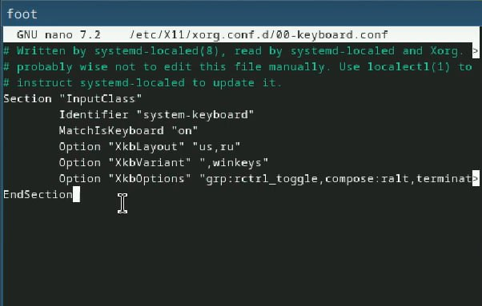

---
## Front matter
title: "Лабораторная работа №1"
subtitle: "Дисциплина: Операционные системы"
author: "Газизянов Владислав Альбертович"

## Generic otions
lang: ru-RU
toc-title: "Содержание"

## Bibliography
bibliography: bib/cite.bib
csl: pandoc/csl/gost-r-7-0-5-2008-numeric.csl

## Pdf output format
toc: true # Table of contents
toc-depth: 2
lof: true # List of figures
lot: true # List of tables
fontsize: 12pt
linestretch: 1.5
papersize: a4
documentclass: scrreprt
## I18n polyglossia
polyglossia-lang:
  name: russian
  options:
	- spelling=modern
	- babelshorthands=true
polyglossia-otherlangs:
  name: english
## I18n babel
babel-lang: russian
babel-otherlangs: english
## Fonts
mainfont: PT Serif
romanfont: PT Serif
sansfont: PT Sans
monofont: PT Mono
mainfontoptions: Ligatures=TeX
romanfontoptions: Ligatures=TeX
sansfontoptions: Ligatures=TeX,Scale=MatchLowercase
monofontoptions: Scale=MatchLowercase,Scale=0.9
## Biblatex
biblatex: true
biblio-style: "gost-numeric"
biblatexoptions:
  - parentracker=true
  - backend=biber
  - hyperref=auto
  - language=auto
  - autolang=other*
  - citestyle=gost-numeric
## Pandoc-crossref LaTeX customization
figureTitle: "Рис."
tableTitle: "Таблица"
listingTitle: "Листинг"
lofTitle: "Список иллюстраций"
lotTitle: "Список таблиц"
lolTitle: "Листинги"
## Misc options
indent: true
header-includes:
  - \usepackage{indentfirst}
  - \usepackage{float} # keep figures where there are in the text
  - \floatplacement{figure}{H} # keep figures where there are in the text
---

# Цель работы

Приобритение навыков по установке операционной системы и сервисов, необходимвх для работы с ней.

# Выполнение лабораторной работы
VirtualBox уже был установлен, поэтому перове, что сдеаем это установим Fedora Sway и зададим базовые настройки(память, процессоры, видеопамять).

.jpeg){#fig:001 width=70%}

Запускаем вирутальную машину и устанавливаем OC. Выбираем язык, регистрируем пользователя и создаём пароли.

.jpeg){#fig:002 width=70%}

Перезапускаем систему, включаем автообновления и загружаем tmux

.jpeg){#fig:003 width=70%}

Отключаем SELinux

.jpeg){#fig:004 width=70%}

Устанавливаем и обновляем драйвера, установив средства разработки dkms, и подмонтировав диск.

.jpeg){#fig:005 width=70%}

Отредатактировав нужные файлы, меняем настройки клавиатуры

{#fig:006 width=70%}

При установке машины имя пользователя было задано верно, а имя хоста нет, следовательно меняем его

.jpeg){#fig:007 width=70%}

Подключаем общую папку (с хостовой машиной)

.jpeg){#fig:008 width=70%}

Устанавливаем Markdown and texlive

.jpeg){#fig:009 width=70%}

.jpeg){#fig:010 width=70%}

## Домашнее задание

Следует получить следующую информацию:

Версия ядра Linux (Linux version).
Частота процессора (Detected Mhz processor).
Модель процессора (CPU0).
Объём доступной оперативной памяти (Memory available).
Тип обнаруженного гипервизора (Hypervisor detected).
Тип файловой системы корневого раздела.
Последовательность монтирования файловых систем.

.jpeg){#fig:011 width=70%}

## Контрольные вопросы

1. Какую информацию содержит учётная запись пользователя?
-Первые буквы имени и отчества, а также фамилию

2. Укажите команды терминала и приведите примеры:

    для получения справки по команде;
    -man
    для перемещения по файловой системе;
    -cd
    для просмотра содержимого каталога;
    -ls
    для определения объёма каталога;
    -du
    для создания / удаления каталогов / файлов;
    -touch, mkdir, rm
    для задания определённых прав на файл / каталог;
    -chmod
    для просмотра истории команд.
	history	
3. Что такое файловая система? Приведите примеры с краткой характеристикой.
-Это способо организации файлов и каталогов на диске.
EXT2-4 - наиболее стабильная в связи с редкими изменениями кодовой базы
JFS - хороша при необходимости высокой стабильности и минимальном потрелении ресурсов XFS - расчитана на файлы больших размеров, имеет незначитльеный размер служебной информации
4. Как посмотреть, какие файловые системы подмонтированы в ОС? С помощью команды mount(без аргументов)
5. Как удалить зависший процесс? Использовать команду kill 

# Выводы
В ходе работы была установлена fedora sway на виртуальную машину, были приобретены навыки по ее установке и работе с ней.

# Список литературы{.unnumbered}

::: {#refs}
:::
