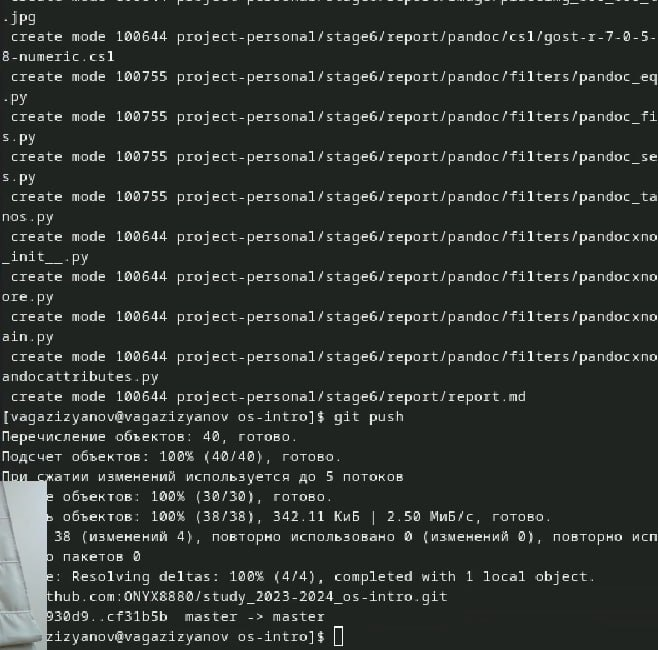

---
## Front matter
lang: ru-RU
title: Лабораторная работа №2
subtitle: Настройка git
author:
  - Газизянов Владислав Альбертович
institute:
  - Российский университет дружбы народов, Москва, Россия
## i18n babel
babel-lang: russian
babel-otherlangs: english

## Formatting pdf
toc: false
toc-title: Содержание
slide_level: 2
aspectratio: 169
section-titles: true
theme: metropolis
header-includes:
 - \metroset{progressbar=frametitle,sectionpage=progressbar,numbering=fraction}
 - '\makeatletter'
 - '\beamer@ignorenonframefalse'
 - '\makeatother'
 
## Fonts
mainfont: PT Serif
romanfont: PT Serif
sansfont: PT Sans
monofont: PT Mono
mainfontoptions: Ligatures=TeX
romanfontoptions: Ligatures=TeX
sansfontoptions: Ligatures=TeX,Scale=MatchLowercase
monofontoptions: Scale=MatchLowercase,Scale=0.9
---

# Цель

## Цель
Изучение работы и назначения системы контроля версий git приобретение навыков по работе с ней.

# Выполнение лабораторной работы

## Установка необходимых программы
:::::::::::::: {.columns align=center}
::: {.column width="50%"}

.jpeg)
:::
::::::::::::::
## Базовая настройка. Личные данные
:::::::::::::: {.columns align=center}
::: {.column width="50%"}

.jpeg)
:::
::::::::::::::

## Базовая настройка. Установка параметров
:::::::::::::: {.columns align=center}
::: {.column width="50%"}

.jpeg)
:::
::::::::::::::

## Создание ключей

:::::::::::::: {.columns align=center}
::: {.column width="70%"}

.jpeg)
:::
::::::::::::::

## Привязка к github

:::::::::::::: {.columns align=center}
::: {.column width="50%"}

.jpeg)
:::
::::::::::::::

## Автоматическая подпись
:::::::::::::: {.columns align=center}
::: {.column width="50%"}

.jpeg)
:::
::::::::::::::

## Создание и клонирование шаблона

:::::::::::::: {.columns align=center}
::: {.column width="50%"}

.jpeg)
:::
::::::::::::::

## Структура курса

:::::::::::::: {.columns align=center}
::: {.column width="50%"}

.jpeg)
:::
::::::::::::::

## Сохранение изменений 
:::::::::::::: {.columns align=center}
::: {.column width="50%"}

:::
::::::::::::::

# Контрольные вопросы

## Ответы на контрольные вопросы 
1. Что такое системы контроля версий (VCS) и для решения каких задач они предназначаются?
- Они применяются при работе нескольких человек с одним проектом. При внесении изменений позволяют фиксировать, совмещать и возвращать изменения разных людей

2. Объясните следующие понятия VCS и их отношения: хранилище, commit, история, рабочая копия.
- Хранилище - место, где находятся данные(файлы, коды и тд)
- Commit - команда, для сохранения изменений
- История - информация о предыдущих изменениях
- Рабочая копия - одна из версий проекта, с которй ведется работа(= текущая/основная)

## Ответы на контрольные вопросы  
3. Что представляют собой и чем отличаются централизованные и децентрализованные VCS? Приведите примеры VCS каждого вида.
- Централизованные системы предполагают наличие единого репозитория для хранения данных(CVC, Subversion)
- В децентрализованных системах центральный репозитроий не обязателен(Git, Bazaar)

4. Опишите действия с VCS при единоличной работе с хранилищем.
Работа происходит на своем компьютере, сначала обновляются данные, в конце они размещаются в центральном репозитории
        
## Ответы на контрольные вопросы 
5. Опишите порядок работы с общим хранилищем VCS.
Для идентификации на сервере необходмы ключи и затем создание репозитория, только затем можно работать на локальной машиной.
Также в конце изменения добавляются на сервер

6. Каковы основные задачи, решаемые инструментальным средством git?
 - хранение информации о всех изменениях
 - обеспечение удобства командной работы
 
## Ответы на контрольные вопросы 

7.  Назовите и дайте краткую характеристику командам git.
- Создание основного дерева репозитория:

git init
- Получение обновлений (изменений) текущего дерева из центрального репозитория:

git pull
- Отправка всех произведённых изменений локального дерева в центральный репозиторий:

git push
- Просмотр списка изменённых файлов в текущей директории:

git status
- Просмотр текущих изменений:

git diff

## Ответы на контрольные вопросы 
7. 

- Сохранение текущих изменений:

добавить все изменённые и/или созданные файлы и/или каталоги:

git add .
добавить конкретные изменённые и/или созданные файлы и/или каталоги:

git rm имена_файлов
Сохранение добавленных изменений:

- сохранить все добавленные изменения и все изменённые файлы:

git commit -am 'Описание коммита'
- сохранить добавленные изменения с внесением комментария через встроенный редактор:

git checkout -b имя_ветки

7. 
- переключение на некоторую ветку:

git checkout имя_ветки
(при переключении на ветку, которой ещё нет в локальном репозитории, она будет создана и связана с удалённой)
отправка изменений конкретной ветки в центральный репозиторий:

git push origin имя_ветки
слияние ветки с текущим деревом:

git merge --no-ff имя_ветки
- Удаление ветки:

удаление локальной уже слитой с основным деревом ветки:

git branch -d имя_ветки
принудительное удаление локальной ветки:

git branch -D имя_ветки
удаление ветки с центрального репозитория:

git push origin :имя_ветки

## Ответы на контрольные вопросы 
8. Приведите примеры использования при работе с локальным и удалённым репозиториями.
локальный репозиторий - работа со своими файлами
удаленный репозиторий - совместная работа, общий проект

9. Что такое и зачем могут быть нужны ветви (branches)?
Ветви это пути к отдельным состовдющим (отделы проекта),они дают возможность вносить изменения только в часть проекта и не трогать все вышестоящее 

10. Как и зачем можно игнорировать некоторые файлы при commit?
Игнорировать файлы можно с помощью .gitignore. Нужно это, например, при наличии ненужных(лишних или созданных автоматически) файлов.

# Вывод

## Вывод

В ходе работы была освоена работа с системой контроля версий, был установлен git, проведена авторизация, заданы базовые настройки, создались ключи, клонировадся репозиторий и так далее.

